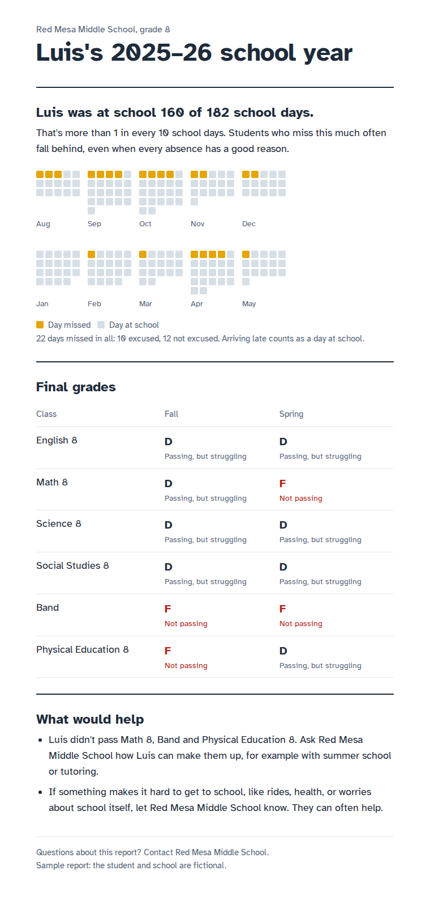
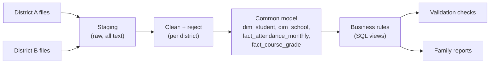

# K–12 District Onboarding Pipeline

An ETL pipeline that takes two school districts' messy, mismatched data exports, loads them into one common data model, applies attendance and grading rules in SQL, and turns the results into plain-language reports for families.

<p align="center"></p>
<p align="center"><em>A generated family report. Each square is one school day; filled squares are days missed.</em></p>

## The problem

Two (fictional) districts sign on to a family-facing reporting app. Each exports from a different student information system, so nothing lines up:

| | District A (PowerSchool-style) | District B (Infinite Campus-style) |
|---|---|---|
| Attendance | One row per student per day, with codes | One row per student per **month**, as totals |
| Grades | Letters with +/− (`B+`) | Percentages (`84.5`) |
| Dates | `MM/DD/YYYY` | `YYYY-MM-DD` |
| Enrollment end date | First day **not** enrolled | Last day enrolled |
| Student IDs | Unique only within the district | Unique only within the district |

Both exports also contain the kinds of errors real district data has: duplicates, a file loaded twice, impossible values, and records that point at students who don't exist.

## Results

Business rules (written as SQL views in [`sql/10_business_rules.sql`](sql/10_business_rules.sql)):

- **Chronically absent:** missed 10% or more of enrolled days (excused, unexcused and suspensions count; late arrivals don't).
- **Core course failure:** an F in English, math, science or social studies in either semester.
- **Early warning status:** *On Track* (neither), *Watch* (one), *Off Track* (both), or *Needs Review* when the attendance data itself can't be trusted.

| School | Students | Chronically absent | Failed a core class | On Track | Watch | Off Track | Needs Review |
|---|---|---|---|---|---|---|---|
| Mesquite Flats High School | 92 | 8 (8.7%) | 9 | 81 | 5 | 6 | 0 |
| Red Mesa Middle School | 98 | 17 (17.3%) | 17 | 72 | 18 | 8 | 0 |
| Juniper Canyon Middle School | 71 | 15 (21.1%) | 11 | 55 | 6 | 10 | 0 |
| Piñon Ridge High School | 89 | 16 (18.4%) | 17 | 67 | 8 | 12 | 2 |

## Data quality: 17 issues found and handled

Every issue is logged with a row count, what was done, and the question to send the district ([`reports/dq_log.csv`](reports/dq_log.csv)). Nothing is dropped silently: rejected rows are kept in `rejected_*` tables.

| District | File | Issue | Rows | Action |
|---|---|---|---|---|
| A | `students.csv` | Exact duplicate rows | 3 | excluded (kept one copy) |
| A | `students.csv` | Same student listed twice with different birth dates | 1 | kept one row, flagged |
| A | `students.csv` | Impossible or placeholder birth date | 2 | flagged (kept student) |
| A | `attendance.csv` | Attendance codes in lowercase ("a" instead of "A") | 334 | fixed (converted to uppercase) |
| A | `attendance.csv` | Recorded outside enrollment dates | 12 | excluded (kept in rejected_a_attendance) |
| A | `attendance.csv` | Recorded on a non-school day | 3 | excluded (kept in rejected_a_attendance) |
| A | `attendance.csv` | Student not in students.csv | 22 | excluded (kept in rejected_a_attendance) |
| A | `stored_grades.csv` | Blank grade (not posted) | 5 | flagged (shown as "not posted yet"; not counted as a failure) |
| B | `enrollment.csv` | Grade level written inconsistently ("06", "6", "Gr 6") | 17 | fixed (converted to a number) |
| B | `enrollment.csv` | Name not in "Last, First" format | 3 | fixed (read as "First Last"), flagged |
| B | `enrollment.csv` | Missing birth date | 2 | flagged (kept student) |
| B | `attendance_monthly.csv` | School name spelled differently from the official name | 86 | fixed (mapped to official school) |
| B | `attendance_monthly.csv` | Same student and month appears twice (duplicate load) | 84 | excluded (kept one copy) |
| B | `attendance_monthly.csv` | Absences exceed days enrolled | 2 | flagged (student's attendance marked "needs review") |
| B | `grades.csv` | Score above 100% | 4 | kept (treated as an A; assumed extra credit) |
| B | `grades.csv` | Blank score (not posted) | 4 | flagged (shown as "not posted yet"; not counted as a failure) |
| A+B | `students.csv / enrollment.csv` | Same student number used in both districts (different students) | 7 | handled (keys include a district prefix) |

## How it works



All transformation logic is SQL (DuckDB). Python only runs the SQL files in order and builds the HTML reports.

## Design decisions

**Student-month as the common level of detail.** District B only sends monthly totals, which can't be broken back down into days. So District A's daily records are rolled up to months, and every rule works from student-month rows.

**District-prefixed keys.** Student number `123160` is a different child in each district (7 numbers overlap). Keys look like `A-123160` and `B-123160`.

**Flag, don't delete.** A wrong birth date is a question for the district, not a reason to drop a student's attendance and grades. Rows that truly can't be used (attendance for a student with no enrollment, attendance on Thanksgiving) go to `rejected_*` tables, and a check confirms raw rows = clean rows + rejected rows.

**Unknown stays unknown.** A blank grade is "not posted yet", never an F. When a student's attendance month has more absences than school days, the student is marked *Needs Review* instead of guessed at. In this data, one of those students would otherwise have been reported as chronically absent (19.3%) because of a single impossible month: 24 absences in a 21-day September. Every other month adds up to about 3%.

**Staff and families see different words.** Staff get *On Track / Watch / Off Track*. Families get what happened and what would help, with no labels or jargon. The family report mentions every class not passed, even though the staff rule only counts core classes.

## Validation

[`sql/11_validation.sql`](sql/11_validation.sql) runs 10 checks after every load, and the pipeline stops if any fail. They include one row per student, one row per student per month, every record linked to a known student and school, and a reconciliation of District A's attendance against the school calendar.

To test the tests, I deliberately reintroduced the duplicate student. The "one row per student per month" check still passed, because `GROUP BY` folded the doubled rows into one row with doubled counts. The calendar reconciliation caught it: that student suddenly had 364 attendance days in a 182-day year.

## Run it

```
pip install duckdb
python run_pipeline.py      # builds the database, prints the data quality log and checks
python build_reports.py     # writes sample family reports to reports/parent_reports/
python q.py "SELECT * FROM v_school_summary"     # query the results
```

Run from the project root. `run_pipeline.py` executes every file in `sql/` in filename order and rebuilds from scratch each time.

## Project structure

```
sql/
  01_staging.sql              extract: load raw files as text
  02_clean_a_students.sql     transform: one file per source table...
  03_ref_calendar.sql           ...plus the school calendar
  04–08_clean_*.sql
  09_model.sql                load: stack both districts into the common model
  10_business_rules.sql       rules as views
  11_validation.sql           automated checks
run_pipeline.py               runs the SQL, prints results, exports CSVs
build_reports.py              family reports (HTML)
q.py                          quick query helper
data/raw/                     the two districts' exports and their notes
reports/                      data quality log, school summary, sample reports
```

## Questions I'd send the districts

- **District A:** Student(s) 131384 appear twice with different birth dates. Which is correct?
- **District A:** Birth dates for student(s) 132581, 138406 look like placeholders or typos. What are the correct dates?
- **District A:** Absences were recorded after student(s) 138385, 127903 withdrew. Did they re-enroll, or should these be removed?
- **District A:** Attendance was recorded on 11/27/2025, which your calendar lists as no school. Entry error?
- **District A:** Attendance exists for student(s) 139204 but there is no enrollment record. Is an enrollment missing?
- **District A:** Grades are blank for 5 course sections in S2. Not yet posted, or missing from the export?
- **District B:** Names for student(s) 107192, 121592, 122266 are not in "Last, First" format. Please confirm first and last names.
- **District B:** Birth dates are missing for student(s) 118316, 122409.
- **District B:** Rows for 2026-02 at Pinon Ridge HS; 2026-02 at Pinon Ridge High School; 2026-02 at Piñon Ridge High School appear twice. Was that month's file loaded twice?
- **District B:** For student(s) 118799 (2026-02), 132692 (2025-09), absences are higher than days enrolled. What are the correct numbers?
- **District B:** Some scores are above 100% (104.0, 101.2, 102.3, 101.3). Is extra credit allowed, or are these entry errors?
- **District B:** Scores are blank for 4 course sections. Not yet posted, or missing from the export?

## Notes

- All data is synthetic, generated to mimic real student information system exports. No real students, schools or districts.
- Reports use [Atkinson Hyperlegible](https://brailleinstitute.org/freefont), a typeface designed for readability, under the SIL Open Font License.
- Built with AI pair-programming (Claude).
